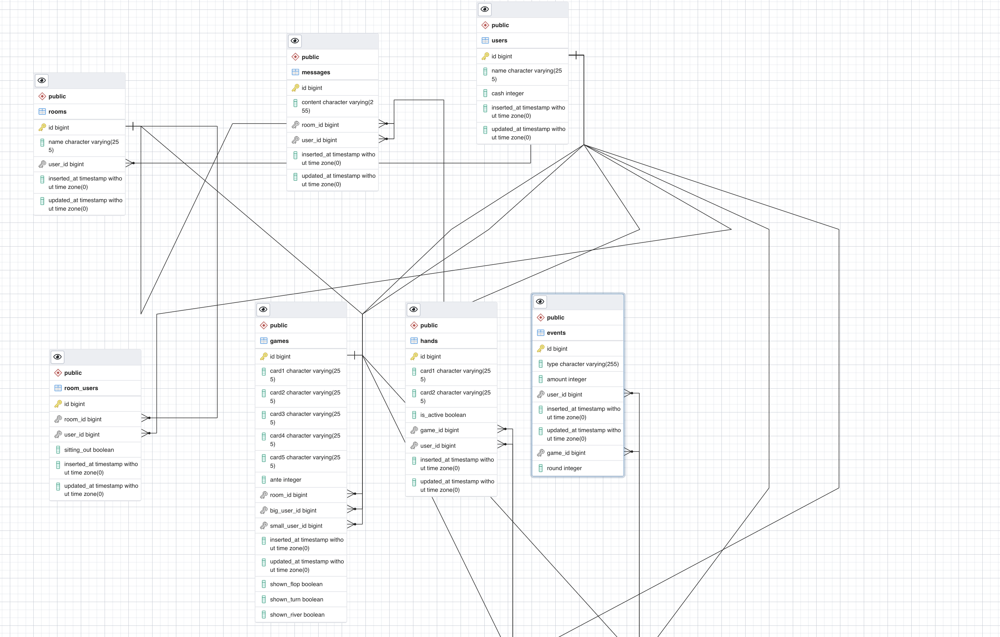

## TLDR

If you just want to try it out [here](https://pokerface.netlify.app) is the link, it is a hobby heroku server so it takes a little time to kick up. If you want to play against yourself just open a new private window and join the same room. It is not supported for mobile since the design makes it hard, maybe a future release will.

## System Design

 

Phoenix comes with Postgres support, so I'm using the beta feature in pgAdmin to auto create the ERD. In the system I use rooms (tables) to generate games. At the beginning of each game I generate all of the cards needed for the game and just mask them to the users at the API level. Hands are also generated and connected to games. From there I use events to handle rounds, and validating bets sent from the client. Messages are currently unused, but this will eventually be used for real time communication between users. I will also use it for notifications like how much someone won and what their hand was.

 

## Evaluating Hands

For evaluating hands I looked at [this](https://medium.com/carwow-product-engineering/the-building-blocks-of-a-poker-application-6042357a58c1) article which was very helpful. I had to rewrite a lot of the code to fit into Texas hold'em
since it evaluates 5 cards instead of 7. I could have probably just iterated over to evaulate every 5 card possiblility, but decided to just evaulate all 7 at the same time.

 

## Building the Table

 

The cards were able to be created using unicode which made it really easy to style tem and size them how I wanted. When a card is masked it comes back as '??', so I was able to show the hidden card and style it red.

### repositories

[frontend](https://github.com/BrooksPoltl/pokerface)

 

[backend](https://github.com/BrooksPoltl/gaga)
